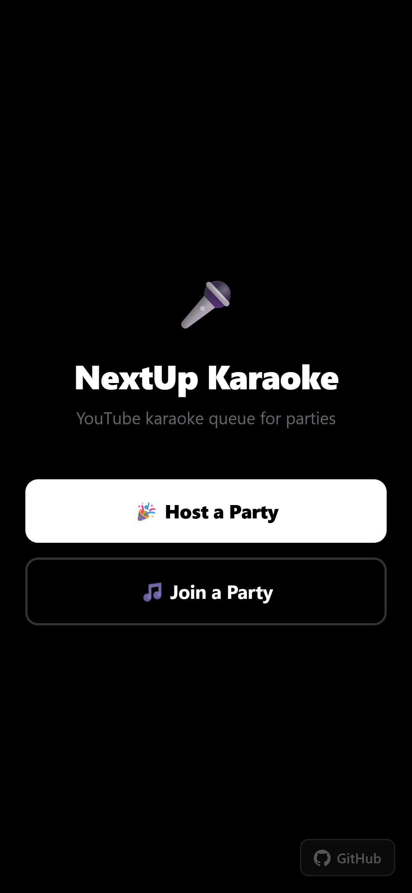
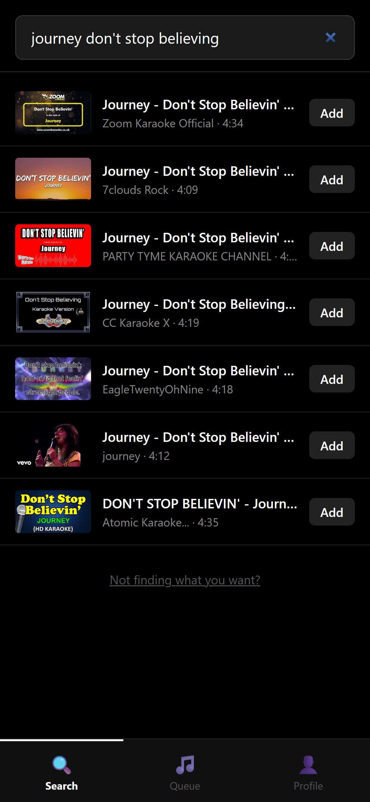
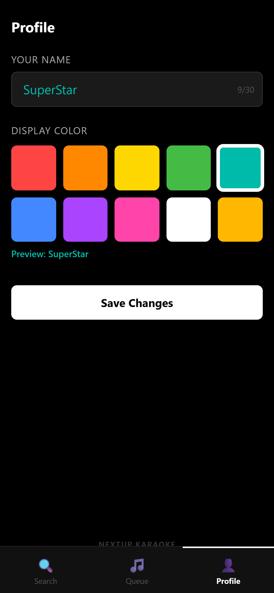
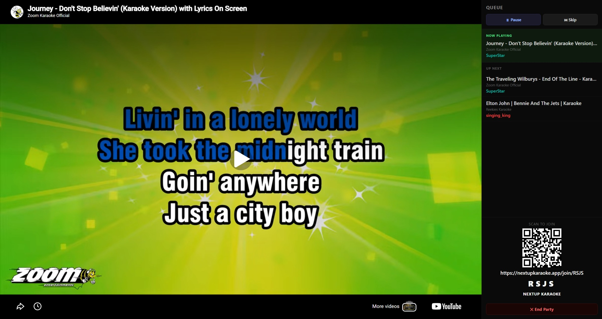

# NextUp Karaoke 🎤

**YouTube karaoke queue for parties** — a real-time web app where guests join from their phones, search for karaoke songs on YouTube, and take turns singing on the big screen.

🌐 **Live demo:** [nextupkaraoke.app](https://nextupkaraoke.app/)

---

## Screenshots

| Landing page | Song search | User profile |
|---|---|---|
|  |  |  |

| Display screen |
|---|
|  |

---

## How it works

1. Opens `/display` on the TV or projector to watch the karaoke from and click **Host a Party** → a 4-letter party code + QR code appears on screen
2. Guests can scan the QR code or go to the app URL and enter the code on their phone
3. Guests can search for any song — searches automatically append "karaoke" to find vocal tracks
4. Songs play in order; when one ends the next starts automatically
5. Anyone can reorder or remove songs from the queue at any time

---

## Features

- **No account required** — guests pick a name and a display color, that's it
- **YouTube search** — no API key needed; searches YouTube directly
- **Real-time sync** — queue updates instantly across all connected devices via WebSocket
- **QR code** — displayed on the big screen so guests can join without typing a URL
- **Party codes** — 4-letter codes let multiple independent parties run simultaneously
- **Auto-advance** — plays the next song automatically when the current one ends

---

## Tech stack

| Layer | Technology |
|---|---|
| Backend | Python, FastAPI, WebSockets |
| Frontend | React 19, TypeScript, Vite |
| Persistence | Redis (falls back to in-memory) |
| Search | `youtube-search` (no API key) |
| Video | YouTube IFrame API |
| Deployment | Render (web service + static site + Redis) |

---

## Running locally

**Backend**

```bash
cd backend
uv sync
uv run uvicorn main:app --reload
# API at http://localhost:8000
```

**Frontend**

```bash
cd frontend
npm install
npm run dev
# App at http://localhost:5173
```

Redis is optional for local dev — the app runs with in-memory state if `REDIS_URL` is not set.

---

## Deploying to Render

The repo includes a `render.yaml` blueprint that provisions all three services (backend, frontend, Redis) in one click.

See [docs/DEPLOYMENT.md](docs/DEPLOYMENT.md) for the full deployment guide.

---

## License

[MIT](LICENSE)
